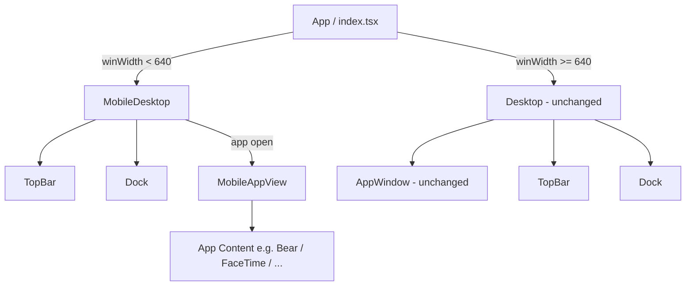

# Design Document: Mobile Optimization

## Overview

This feature introduces a dedicated mobile rendering path for the macOS-themed portfolio web app. When the viewport width is below 640 px the app renders a new `MobileDesktop` component instead of the existing `Desktop` component. The mobile shell provides a full-screen, single-app-at-a-time experience with no drag-and-resize behavior. The existing desktop code path is left completely untouched.

The 640 px threshold matches the existing `sm:` breakpoint already used throughout the codebase (Dock, TopBar, Launchpad), so no new breakpoint value is introduced.

### Key Design Decisions

- **Conditional rendering in `App`** — `useWindowSize` is called once at the root and the result drives which page component is mounted. This keeps the gate in one place and avoids duplicating state.
- **No modification to `Desktop` or `AppWindow`** — the desktop path is preserved exactly as-is, satisfying Requirement 9.
- **`MobileAppView` is a thin wrapper** — it owns only the title bar and close button; the actual app content component is passed as a child, identical to how `AppWindow` works today.
- **Bear and FaceTime adapt via `winWidth`** — both components already receive `winWidth` indirectly through `useWindowSize`; a local call to the hook inside each component is the minimal change needed.
- **ControlCenterMenu uses existing responsive classes** — the panel already has `right-0 sm:right-1.5`; only the width class needs a mobile override.

---

## Architecture



The rendering gate lives entirely in `App` (`src/index.tsx`). Both `MobileDesktop` and `Desktop` receive the same `MacActions` props. All shared components (`TopBar`, `Dock`, `Launchpad`, `ControlCenterMenu`) are reused without duplication; mobile-specific layout differences are handled inside each component via responsive classes or `winWidth` checks.

---

## Components and Interfaces

### `App` (`src/index.tsx`) — modified

Adds a `useWindowSize` call and conditionally renders `MobileDesktop` or `Desktop` after the login gate.

```ts
// Pseudocode — only the login branch changes
const { winWidth } = useWindowSize();
// ...
if (login) {
  return winWidth < 640
    ? <MobileDesktop {...macActions} />
    : <Desktop {...macActions} />;
}
```

### `MobileDesktop` (`src/pages/MobileDesktop.tsx`) — new

Full-screen mobile shell. Mirrors the structure of `Desktop` but without windowed app management.

```ts
interface MobileDesktopState {
  openAppId: string | null;   // at most one app open at a time
  currentTitle: string;
}

export default function MobileDesktop(props: MacActions): JSX.Element
```

Responsibilities:
- Renders wallpaper background (day/night from store).
- Renders `TopBar` and `Dock`.
- Tracks `openAppId` (single open app).
- When `openAppId` is set, renders `MobileAppView` with the matching app content.
- Passes `open` callback to `Dock`; opening a second app replaces the first.

### `MobileAppView` (`src/components/MobileAppView.tsx`) — new

Full-screen app wrapper for mobile. No `react-rnd`, no `TrafficLights`.

```ts
interface MobileAppViewProps {
  title: string;
  onClose: () => void;
  children: React.ReactNode;
}

export default function MobileAppView(props: MobileAppViewProps): JSX.Element
```

Layout:
- Fixed title bar (same height as `appBarHeight` = 24 px) with app name and a close `×` button.
- Scrollable content area filling the remaining height (`calc(100vh - topBarHeight - dockHeight - appBarHeight)`).
- No `react-rnd`, no traffic lights.

### `Bear` (`src/components/apps/Bear.tsx`) — modified

Adds a collapsible navigation panel on mobile.

- Calls `useWindowSize()` internally.
- When `winWidth < 640`: hides sidebar + middlebar columns by default; shows a hamburger/nav toggle button in the content area header; tapping the toggle shows sidebar + middlebar as an overlay panel; selecting a middlebar item closes the panel.
- When `winWidth >= 640`: existing three-column layout unchanged.

### `FaceTime` (`src/components/apps/FaceTime.tsx`) — modified

Switches from absolute-overlay sidebar to vertical stack on mobile.

- Calls `useWindowSize()` internally.
- When `winWidth < 640`: sidebar renders above the webcam view (`flex-col`), full width, no `absolute` positioning.
- When `winWidth >= 640`: existing `absolute w-74` sidebar layout unchanged.

### `ControlCenterMenu` (`src/components/menus/ControlCenterMenu.tsx`) — modified

Full-width on mobile.

- Current class: `w-80 … pos="fixed top-9.5 right-0 sm:right-1.5"`.
- Change: replace `w-80` with `w-full sm:w-80` so the panel spans the viewport on mobile.
- No logic changes; purely a CSS class adjustment.

### `Launchpad` (`src/components/Launchpad.tsx`) — already handled

The grid already uses `grid="~ flow-row cols-4 sm:cols-7"` — 4 columns on mobile, 7 on desktop. No code change needed.

### `Dock` (`src/components/dock/Dock.tsx`) — already handled

Already has `w="full sm:max"` and `overflow="x-scroll sm:x-visible"`. No code change needed.

---

## Data Models

### `MobileDesktopState`

```ts
interface MobileDesktopState {
  openAppId: string | null;   // ID of the currently open app, or null for home screen
  currentTitle: string;       // title shown in TopBar
}
```

### Reused types (unchanged)

```ts
// src/types/index.d.ts — no changes
interface MacActions {
  setLogin: (value: boolean | ((prev: boolean) => boolean)) => void;
  shutMac: (e: React.MouseEvent) => void;
  sleepMac: (e: React.MouseEvent) => void;
  restartMac: (e: React.MouseEvent) => void;
}
```

The Zustand store (`useStore`) is consumed by `MobileDesktop` the same way `Desktop` does — reading `dark` and `brightness` for the wallpaper background.

---

## Correctness Properties

*A property is a characteristic or behavior that should hold true across all valid executions of a system — essentially, a formal statement about what the system should do. Properties serve as the bridge between human-readable specifications and machine-verifiable correctness guarantees.*

### Property 1: Rendering gate is correct for all viewport widths

*For any* viewport width value, the `App` component SHALL render `MobileDesktop` when `winWidth < 640` and `Desktop` when `winWidth >= 640`. This holds on initial mount and after any resize event that crosses the 640 px breakpoint in either direction.

**Validates: Requirements 1.1, 1.2, 1.3**

---

### Property 2: MacActions props are forwarded to MobileDesktop

*For any* set of `MacActions` callback functions passed to `App`, those same callbacks SHALL be forwarded unchanged to `MobileDesktop` (i.e., invoking `setLogin`, `shutMac`, `sleepMac`, or `restartMac` on the `MobileDesktop` instance invokes the original function).

**Validates: Requirements 1.4**

---

### Property 3: Wallpaper reflects dark-mode store value

*For any* value of the `dark` store flag, the `MobileDesktop` background image URL SHALL equal `wallpapers.night` when `dark` is `true` and `wallpapers.day` when `dark` is `false`.

**Validates: Requirements 2.2**

---

### Property 4: Opening any app renders MobileAppView

*For any* valid app ID passed to the `open` callback in `MobileDesktop`, the component SHALL render `MobileAppView` with that app's content and title.

**Validates: Requirements 2.6**

---

### Property 5: At most one app open at a time

*For any* sequence of `open(appId)` calls on `MobileDesktop`, only the most recently opened app SHALL be rendered; all previously open apps SHALL be cleared.

**Validates: Requirements 2.7**

---

### Property 6: MobileAppView title bar contains app name and close button

*For any* non-empty app title string, the `MobileAppView` title bar SHALL contain that string and a close button element.

**Validates: Requirements 3.2**

---

### Property 7: Close button invokes onClose callback

*For any* `onClose` callback function passed to `MobileAppView`, activating the close button SHALL invoke that callback exactly once.

**Validates: Requirements 3.3**

---

### Property 8: Bear hides navigation columns on mobile by default

*For any* `winWidth < 640`, the `Bear` component SHALL not render the sidebar and middlebar columns in the default (nav-closed) state, and SHALL render a navigation toggle button.

**Validates: Requirements 4.1, 4.2**

---

### Property 9: Bear nav toggle shows and hides the panel

*For any* `winWidth < 640`, activating the navigation toggle SHALL show the sidebar and middlebar panel; selecting a middlebar item SHALL close the panel and update the displayed content.

**Validates: Requirements 4.3, 4.4**

---

### Property 10: Bear three-column layout preserved on desktop

*For any* `winWidth >= 640`, the `Bear` component SHALL render all three columns (sidebar, middlebar, content) simultaneously without a toggle button.

**Validates: Requirements 4.5**

---

### Property 11: FaceTime layout is vertical stack on mobile, absolute overlay on desktop

*For any* `winWidth < 640`, the `FaceTime` component SHALL render the sidebar above the webcam view in a vertical (`flex-col`) layout with no absolute positioning on the sidebar. *For any* `winWidth >= 640`, the sidebar SHALL retain its `absolute` positioning.

**Validates: Requirements 5.1, 5.4**

---

### Property 12: ControlCenterMenu spans full width on mobile, fixed width on desktop

*For any* `winWidth < 640`, the `ControlCenterMenu` SHALL have `w-full` applied (no fixed pixel width). *For any* `winWidth >= 640`, the menu SHALL have `w-80` applied.

**Validates: Requirements 6.1, 6.3**

---

## Error Handling

- **`useWindowSize` on SSR / zero-width**: The existing hook reads `window.innerWidth` directly. If this ever returns `0` (e.g., during testing without a DOM), the gate condition `winWidth < 640` evaluates to `true`, rendering `MobileDesktop`. This is acceptable — tests that need the desktop path should mock `window.innerWidth` to a value ≥ 640.
- **Unknown app ID in `MobileDesktop.open`**: If an app ID not present in the `apps` config is passed, `MobileDesktop` should log a warning and leave `openAppId` unchanged (same defensive pattern as `Desktop.openApp`).
- **Webcam unavailable in FaceTime on mobile**: No change to existing error handling; `react-webcam` already handles permission denial gracefully.
- **Bear markdown fetch failure**: No change to existing error handling in `Content`; the `catch` block already logs the error.

---

## Testing Strategy

### Dual Testing Approach

Both unit tests and property-based tests are required. Unit tests cover specific structural examples and edge cases; property-based tests verify universal behaviors across generated inputs.

### Unit Tests (specific examples and structure)

- `App` renders `MobileDesktop` when `winWidth = 320` (example).
- `App` renders `Desktop` when `winWidth = 1024` (example).
- `MobileDesktop` home screen contains `TopBar`, `Dock`, and wallpaper background; does not contain `MobileAppView` (example — validates Requirements 2.3, 2.4, 2.5).
- `MobileAppView` does not render `Rnd` or `TrafficLights`; content area has `overflow-y-auto` (example — validates Requirements 3.4, 3.5, 3.6).
- `FaceTime` sidebar has `w-full` class when `winWidth = 320` (example — validates Requirement 5.2, 5.3).
- `ControlCenterMenu` is anchored at `top-9.5 right-0` on mobile (example — validates Requirement 6.2).

### Property-Based Tests

Use **fast-check** (already compatible with the Vitest setup in this project).

Each property test runs a minimum of **100 iterations**.

Tag format: `// Feature: mobile-optimization, Property N: <property_text>`

| Property | Generator | Assertion |
|---|---|---|
| P1: Rendering gate | `fc.integer({ min: 0, max: 2000 })` for winWidth | winWidth < 640 → MobileDesktop rendered; winWidth >= 640 → Desktop rendered |
| P2: MacActions forwarding | `fc.record({ setLogin: fc.func(fc.constant(undefined)), ... })` | Each callback on MobileDesktop invokes the original |
| P3: Wallpaper dark/light | `fc.boolean()` for dark flag | Background URL matches expected wallpaper |
| P4: Open app renders MobileAppView | `fc.constantFrom(...appIds)` | MobileAppView present with correct title |
| P5: Single app at a time | `fc.array(fc.constantFrom(...appIds), { minLength: 2 })` | Only last opened app is rendered |
| P6: Title bar content | `fc.string({ minLength: 1 })` for title | Title string and close button present in output |
| P7: Close button callback | `fc.func(fc.constant(undefined))` for onClose | onClose called exactly once on button click |
| P8: Bear mobile default state | `fc.integer({ min: 0, max: 639 })` for winWidth | Sidebar/middlebar absent; toggle button present |
| P9: Bear nav toggle round-trip | `fc.integer({ min: 0, max: 639 })`, `fc.nat()` for item index | Toggle → panel visible; select item → panel hidden, content updated |
| P10: Bear desktop layout | `fc.integer({ min: 640, max: 2000 })` | All three columns present; no toggle button |
| P11: FaceTime layout | `fc.integer({ min: 0, max: 639 })` and `fc.integer({ min: 640, max: 2000 })` | Mobile: flex-col, no absolute; Desktop: absolute sidebar |
| P12: ControlCenterMenu width | `fc.integer({ min: 0, max: 639 })` and `fc.integer({ min: 640, max: 2000 })` | Mobile: w-full; Desktop: w-80 |

### Test File Locations

```
src/
  __tests__/
    App.test.tsx              # P1, P2, P3 + unit examples
    MobileDesktop.test.tsx    # P4, P5 + unit examples
    MobileAppView.test.tsx    # P6, P7 + unit examples
    Bear.mobile.test.tsx      # P8, P9, P10
    FaceTime.mobile.test.tsx  # P11 + unit examples
    ControlCenterMenu.mobile.test.tsx  # P12 + unit examples
```
